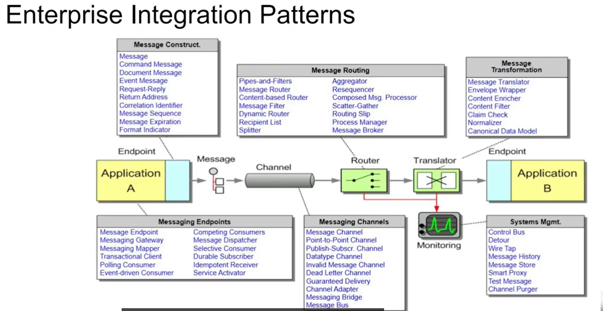

## Enterprise Integration
sw integration --> combining multiple separated sw programs together in one system
EIP --> combining multiple separate enterprise sw peices together

## routes 
Apache camel risolve il problema di integrazione di processi enterprise separati
utilizza l'approccio basato sulle routes.
Le routes sono come mappe che mostrano come i dati transitano da un sistema all'altro,
soprattutto in quei contesti in cui occorre far comunicare sistemi con stack tecnologici diversi

## Risorse EIP 
https://www.enterpriseintegrationpatterns.com/
https://camel.apache.org/components/4.18.x/eips/enterprise-integration-patterns.html